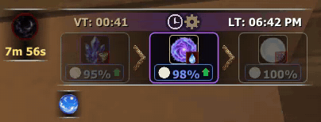
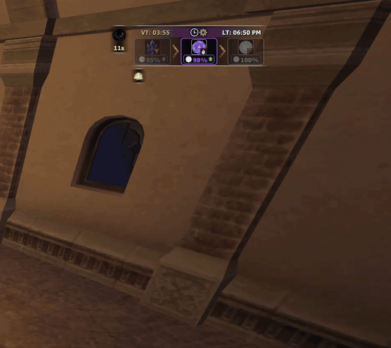
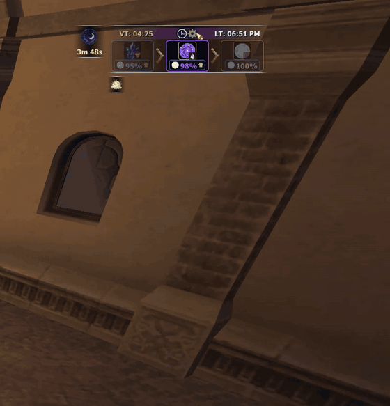

<p align="center">
  
</p>

# Vana'Dial

Standalone Ashita v4 addon for Horizon XI / FFXI: Vana'diel time, elemental days, moon phase, zone weather, and transport timers (airships, boats, RSE, lunar).

## See it in action

**Clock, days, moon phase, and Fenrir tooltip**



**Airship, boat, RSE, and lunar timers**



**Settings** (`/vd config`)



## Install

Clone or copy this folder into your Ashita `addons` directory:

```
Game/addons/vanadial/
```

Load with `/addon load vanadial` (or add to your default load list).

Per-character settings are stored under `Game/config/addons/vanadial/<character>/settings.lua`.

## Commands

| Command | Action |
|---------|--------|
| `/vd` | Toggle visibility |
| `/vd config` | Open configuration |
| `/vd ships` | Toggle airship timers (expand section) |
| `/vd boats` | Toggle ferry boat timers (Selbina/Mhaura/Whitegate/Nashmau) |
| `/vd boatsall` | Toggle all boat timer sub-groups |
| `/vd manaclipper` | Toggle Bibiki Manaclipper timers |
| `/vd barge` | Toggle Carpenters' Landing barge timers |
| `/vd rse` | Toggle RSE timers |
| `/vd lunar` | Toggle lunar phase timers |
| `/vd sunbreezerace` | Toggle the independent standalone Sunbreeze Racing event window |
| `/vd reset` | Reset the Vana'Dial and Sunbreeze Racing window positions |
| `/vd update` | Download latest from GitHub (`main` branch); then `/addon reload vanadial` |
| `/vd checkupdate` | Check GitHub for a newer version |
| `/vanadial` | Alias for `/vd` |

On login, Vana'Dial checks GitHub once (after a short delay) and prints a chat message if a newer version is available.

**Updating:** Run `/vd update` in-game (downloads addon files from GitHub, same as Anglin). Then `/addon reload vanadial`. Per-character settings under `config/addons/vanadial/` are not overwritten.

## Requirements

- Ashita v4 with `imgui`, `settings`, and `ffxi` libs (standard Horizon XI Ashita install)
